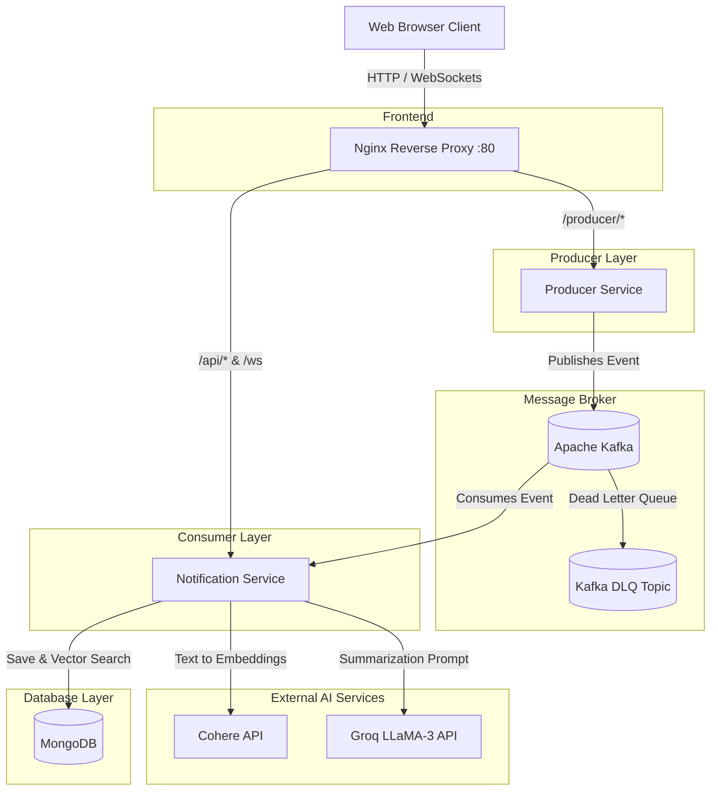

# Real-Time Event-Driven Notification System 🚀

An enterprise-grade, event-driven notification system designed for high scalability, real-time delivery, and AI-powered insights. Built with Java Spring Boot, Apache Kafka, MongoDB Vector Search, and large language models (Cohere & Groq), this system handles complex event streams and delivers them instantly to connected users.

---

## 🚀 Live Demo

You can view the live deployed application here:
[http://notif-system.centralindia.cloudapp.azure.com](http://notif-system.centralindia.cloudapp.azure.com)

### 🎥 Video Demonstration

https://github.com/user-attachments/assets/3144589f-2ff3-43f2-8199-9618ae833ee9

---
## 🌟 Highlights & Key Capabilities

- **Real-Time WebSocket Delivery:** Bi-directional communication ensures users receive notifications instantly in the browser without polling.
- **Event-Driven Microservices Architecture:** Services are fully decoupled using Apache Kafka as a message broker, ensuring high throughput, fault tolerance, and horizontal scalability.
- **Semantic Vector Search:** Powered by **Cohere's `embed-english-light-v3.0`** and **MongoDB Atlas Vector Search**, allowing users to search notifications by *meaning* rather than exact keywords.
- **AI-Powered Summarization:** Uses **Groq (LLaMA-3)** to instantly summarize long, complex, or verbose notifications into concise bullet points, enhancing user readability.
- **Dead Letter Queue (DLQ):** Enterprise-grade error handling. Failed messages or malformed payloads are automatically routed to a DLQ topic to ensure zero data loss.
- **Secure Authentication:** JWT-based authentication protects API endpoints and ensures notifications are routed securely to the correct user sessions.

---

## 🏗️ System Architecture

The application is split into multiple dockerized components, orchestrated by `docker-compose` and routed through an Nginx reverse proxy.



---

## 💻 Technology Stack

### Backend
- **Java 17 & Spring Boot 3:** Core framework for microservices.
- **Spring Kafka:** For producing and consuming event streams.
- **Spring Security & JWT:** For stateless authentication and authorization.
- **Spring WebSocket & STOMP:** For real-time client-server communication.

### Database & Message Broker
- **Apache Kafka (KRaft Mode):** Event streaming and messaging backbone.
- **MongoDB 6.0:** NoSQL document database.
- **MongoDB Vector Search:** For executing semantic cosine-similarity queries against notification embeddings.

### Artificial Intelligence
- **Cohere:** Generates vector embeddings for all incoming notifications.
- **Groq (LLaMA-3):** Provides ultra-fast inference for text summarization.

### DevOps & Infrastructure
- **Docker & Docker Compose:** Containerization of all services.
- **Nginx:** Acts as an API Gateway and serves the static frontend.
- **GitHub Actions:** CI/CD pipeline for automated testing and deployment.
- **Microsoft Azure:** Cloud hosting (Ubuntu Linux VM).

---

## 🔌 API Endpoints

### Producer Service (Port 8081 / `http://<host>/producer/`)
| Method | Endpoint | Description |
|--------|----------|-------------|
| `POST` | `/event` | Publishes a raw event to the Kafka topic. |
| `POST` | `/demo` | Fires a sequential demo burst of notifications for testing. |

### Notification Service (Port 8082 / `http://<host>/api/`)
| Method | Endpoint | Description |
|--------|----------|-------------|
| `POST` | `/api/auth/register` | Registers a new user. Returns JWT. |
| `POST` | `/api/auth/login` | Authenticates a user. Returns JWT. |
| `GET`  | `/api/notifications` | Fetches a user's notification history. |
| `GET`  | `/api/notifications/search` | Performs a semantic search against notifications using a query string. |


## 🛠️ Local Development Setup

### Prerequisites
- Docker and Docker Compose installed.
- API keys from [Groq](https://console.groq.com/) and [Cohere](https://dashboard.cohere.com/).

### 1. Configure Environment Variables
Create a `.env` file in the root directory:
```env
# Kafka external hostname (leave as localhost for local dev)
KAFKA_EXTERNAL_HOST=localhost

# JWT Secret Key (Any long string)
JWT_SECRET=your_super_secret_jwt_key_here

# AI API Keys
COHERE_API_KEY=your_cohere_api_key
GROQ_API_KEY=your_groq_api_key
```

### 2. Run with Docker Compose
From the root directory, simply start the cluster:
```bash
docker compose up --build -d
```

This will spin up:
- `kafka` (Port 9092/29093)
- `mongodb` (Port 27017)
- `producer-service`
- `notification-service`
- `nginx` (Port 80)

### 3. Access the Application
Open your browser and navigate to `http://localhost:80`.

---

## 🔄 CI/CD Pipeline

This project leverages **GitHub Actions** for automated deployments. 

The pipeline is triggered on every push to the `main` branch:
1. Actions Runner checks out the latest code.
2. Securely authenticates with the Azure VM via SSH using GitHub Secrets.
3. Pulls the latest commits.
4. Executes a seamless `docker compose up --build -d` to rebuild the Java microservices and restart the containers with zero downtime.
